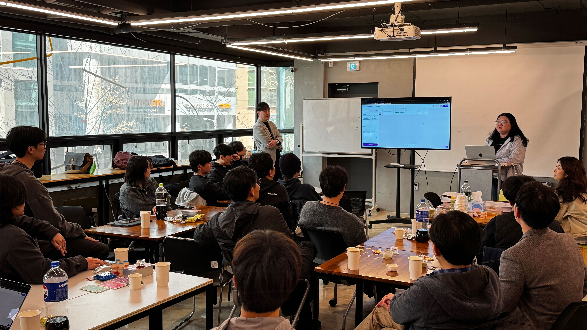
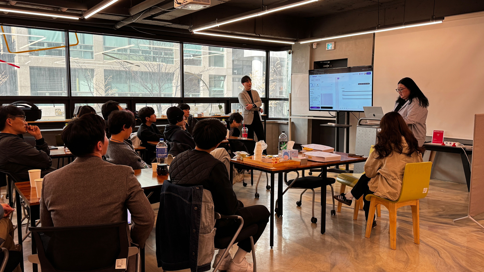

# 오름캠프 Flutter 3기 회고

 #모두의연구소 #오름캠프 #플러터 #앱개발 #생존코딩

## 👣 시작은 웹 퍼블리셔였다

처음 나는 웹 퍼블리셔로 개발 업계에 발을 디뎠다. 디자인과 마크업을 넘나들며 일하다 보니 자연스럽게 개발에 대한 관심이 생겼고, 그렇게 앱 개발 쪽으로 조금씩 방향을 틀기 시작했다. 처음엔 단순히 기능을 구현하는 데 만족했지만, 어느 순간부터 한계를 느끼기 시작했다.

코드는 짜고 있는데, 왜 이렇게 동작하는지 설명할 수 없었다.  
실무를 통해 Flutter라는 프레임워크를 접하면서 '이거다!' 싶을 만큼 매력적인 기술이라는 확신이 생겼지만, 그럴수록 내가 가진 기초의 부실함이 더 크게 느껴졌다.

## 🧭 퇴사, 그리고 다시 시작

이건 혼자 해결할 수 있는 문제가 아니라고 판단했고, 때마침 입은 손목과 팔의 부상 으로 인해 ,결국 나는 회사를 퇴사했다.  
딱 한 번, 제대로 기초부터 다시 배우자는 마음으로 공부할 방법을 찾기 시작했다.  
그러다 인프런에서 오준석 강사님의 강의를 보게 됐고, “이분에게 직접 배울 수 있다면 정말 좋겠다”는 생각이 강하게 들었다.  
마침 오름캠프 플러터 과정 3기를 모집하고 있었고, 망설임 없이 지원하게 되었다.

## 🔨 기초부터 다시 쌓는 개발 실력

캠프에 참여하고 가장 놀랐던 건, Dart에 이렇게 오랜 시간을 할애한다는 점이었다.  
처음엔 ‘이렇게까지 해야 하나?’ 싶었지만, 시간이 지날수록 왜 그래야 했는지 깨달았다.  
이전에 놓쳤던 개념들이 하나하나 연결되며 머릿속이 정리됐고, Flutter의 구조와 문법이 훨씬 수월하게 이해되기 시작했다.  
코드를 짜는 손보다, 생각하는 머리가 더 바빠지는 느낌이었다.

## 🤝 혼자가 아닌 함께 성장하는 시간

또한 이곳에서의 하루하루는 혼자가 아니었다.  
Zoom과 Gather를 통해 얼굴을 마주 보며 함께 배우고, 실시간으로 질문하고 대답하며 문제를 풀어나가는 환경은 그 자체로 동기부여였다.  
누군가와 코드에 대해 이야기하고, 서로의 생각을 공유하며 성장하는 경험은 나에게 새로운 자극이자 큰 위안이 되었다.

## 📚 하루하루 쌓여가는 성취감

매일 과제를 하고, 회고를 쓰고, 배운 내용을 정리하면서 하루하루 쌓아가는 느낌이 좋았다.  
단순히 스펙을 채우는 수업이 아니라, 내가 진짜로 성장하고 있다는 실감이 드는 시간들이었다.

## 🎤 오프라인 밋업에서의 발표 경험

특히 인상 깊었던 경험 중 하나는 오프라인 밋업에서의 발표였다.  
나는 그 자리에서 **내가 평소에 자주 활용하는 AI 도구**를 주제로 발표를 진행했다.  
단순한 기능 소개가 아닌, 실무와 학습에 어떻게 도움이 되는지를 실제 사용 예시를 통해 소개했고, 다른 수강생들에게도 새로운 도구를 알려줄 수 있었다.

발표를 준비하면서 내가 알고 있는 내용을 다시 정리하고, 다른 사람에게 전달하는 과정에서  
**단순히 배우는 것에서 나아가 ‘공유하는 개발자’로서의 첫걸음**을 내디딜 수 있었던 소중한 경험이었다.  
서로의 발표를 들으며 자극도 받았고, 나 자신도 더 배우고 성장하고 싶다는 동기부여가 되었다.

## 🌱 내가 되고 싶은 개발자

이 과정을 마치며 나는 예전과는 조금 다른 개발자가 되어 있었다.  
이제는 ‘어떻게 만들 것인가’뿐 아니라, ‘왜 이렇게 만들어야 하는가’를 고민할 줄 아는 눈을 가지게 되었고,  
혼자만 잘하는 개발자가 아니라, 함께 나누며 성장할 수 있는 개발자가 되고 싶다는 새로운 목표도 생겼다.

그리고 언젠가,  
나처럼 기초 부족으로 힘들어하는 누군가에게 실질적인 도움이 되는 앱을 만들고 싶다.  
작은 기능이라도 그 사람에게 꼭 필요한 도구가 된다면, 그게 내가 개발자가 된 이유로 충분하다고 생각한다.
